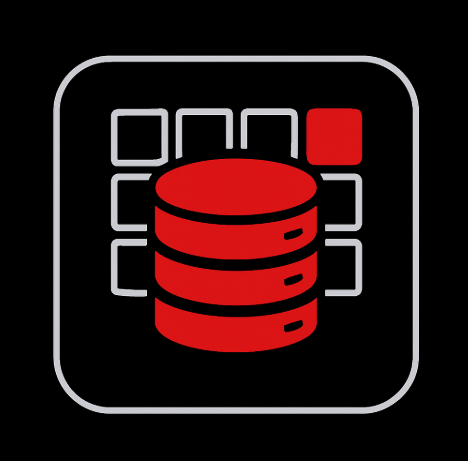

<!-- Improved compatibility of back to top link -->
<a id="readme-top"></a>

<!-- PROJECT SHIELDS -->
<div align="center">

![Status][status-badge] [![Issues][issues-shield]][issues-url] [![License][license-shield]][license-url] [![Last Commit][last-commit-shield]][last-commit-url] [![Made With Love][love-badge]][repo-url]

</div>

<!-- PROJECT LOGO -->
<div align="center">
	
	<h1 align="center">Master Control Center (StackDash)</h1>
	<p align="center">
		Multi‑page, local‑first dashboard for links, apps & live widgets — with optional native & custom protocol launching.
		<br />
		<a href="#about-the-project"><strong>Explore the docs »</strong></a>
		·
		<a href="#getting-started">Get Started</a>
		·
		<a href="#roadmap">Roadmap</a>
		·
		<a href="#contributing">Contribute</a>
	</p>
</div>

<details>
	<summary>Table of Contents</summary>
	<ol>
		<li><a href="#about-the-project">About the Project</a>
			<ul>
				<li><a href="#core-structure">Core Structure</a></li>
				<li><a href="#key-features">Key Features</a></li>
				<li><a href="#tech-stack">Tech Stack</a></li>
				<li><a href="#built-with">Built With</a></li>
				<li><a href="#architecture-overview">Architecture Overview</a></li>
			</ul>
		</li>
		<li><a href="#screenshots--showcase">Screenshots / Showcase</a></li>
		<li><a href="#getting-started">Getting Started</a>
			<ul>
				<li><a href="#prerequisites">Prerequisites</a></li>
				<li><a href="#installation-as-extension">Installation (Chrome Extension)</a></li>
				<li><a href="#optional-native-launching">Optional: Native Launching</a></li>
				<li><a href="#optional-custom-url-protocols">Optional: Custom URL Protocols (Windows)</a></li>
			</ul>
		</li>
		<li><a href="#usage">Usage</a></li>
		<li><a href="#widgets">Widgets</a></li>
		<li><a href="#configuration">Configuration</a></li>
		<li><a href="#data-export--import">Data Export / Import</a></li>
		<li><a href="#performance-and-caching">Performance & Caching</a></li>
		<li><a href="#security--privacy">Security & Privacy</a></li>
		<li><a href="#directory-structure">Directory Structure</a></li>
		<li><a href="#roadmap">Roadmap</a></li>
		<li><a href="#contributing">Contributing</a></li>
		<li><a href="#faq">FAQ</a></li>
		<li><a href="#license">License</a></li>
		<li><a href="#acknowledgments">Acknowledgments</a></li>
	</ol>
</details>

## About the Project
**Master Control Center (StackDash)** is a modular, local‑first dashboard for homelab, productivity and app launching workflows. It combines:

* Multi-page / tabbed layout
* Grouped tiles for links, programs & widgets
* Live data widgets (weather, RSS, uptime, iframe, covid)
* Visual customization (themes, fonts, glow accent)
* Fast local persistence & backup/restore
* Optional native + custom protocol launching

### Core Structure
| Layer | Purpose |
|-------|---------|
| UI (HTML/CSS/ES Modules) | Renders pages, groups, modals, settings |
| State Manager | Loads, migrates & persists data to extension storage |
| Renderers | Pages bar & groups/widgets orchestration |
| Widgets Engine | Weather, RSS, UptimeRobot, IFrame, COVID |
| Settings Panel | Theme / font / glow / cache / backup / APIs |
| Actions & Events | Export/import/reset & delegated interactions |
| Native Bridge (MV3) | Optional messaging for local program launch |
| Windows Helpers | Protocol registration & batch launchers |

### Key Features
**Layout & Interaction**  
Multi-page tabs (overflow adaptive), per-page groups, drag & drop ordering, edit mode toggle.

**Customization**  
Themes (system/light/dark/crimson), searchable font catalog, glow effect (color + contrast safety), responsive overflow.

**Link & Program Management**  
Icon modes (favicon / logo.dev / URL / upload), domain guessing, program launch via scheme or optional native method, notes & arguments.

**Widgets**  
Weather (Open-Meteo, keyless), RSS (proxy fallback + new highlight), UptimeRobot (status + uptime tiers), IFrame (sandboxed), COVID stats.

**Data & Persistence**  
Local extension storage, timestamped export, schema-normalized import, migration-safe IDs.

**Performance**  
Lazy icon loading, unified cache pool (TTL + pruning), idle scheduling, lean service worker.

**Reliability & Safety**  
Defensive error handling, isolated logo key, sandboxed iframes, native allowlist, CORS fallback cascade.

### Tech Stack
| Domain | Technologies |
|--------|--------------|
| Frontend | HTML5, CSS3, ES Modules |
| Browser Extension | Chrome MV3 (service worker + storage) |
| Scripts | PowerShell, Batch (.bat), Python (utility GUI), Node (native host example) |
| Data | JSON state + in-memory caches |
| APIs | Open-Meteo, logo.dev, UptimeRobot, disease.sh, RSS feeds |

### Built With
* [![HTML5][html5-badge]][html5-url]
* [![CSS3][css3-badge]][css3-url]
* [![JavaScript ES Modules][js-badge]][js-url]
* [![Chrome MV3][mv3-badge]][mv3-url]
* [![Node.js][node-badge]][node-url]
* [![PowerShell][ps-badge]][ps-url]
* [![Python][python-badge]][python-url]
* [![Batch][batch-badge]][batch-url]


### Architecture Overview
1. Extension action opens dashboard.
2. `main.js` loads & migrates state → initial render.
3. User edits update in-memory STATE → debounced persist.
4. Widgets hydrate from cache or network (proxy fallback logic for RSS).
5. Program tiles launch via scheme or native host (if configured).

## Screenshots / Showcase
> Replace placeholders with actual images in an `images/` folder.

| Dashboard | Pages Overflow | Widgets |
|-----------|----------------|---------|
| ![Dashboard][shot-dashboard] | ![Overflow][shot-overflow] | ![Widgets][shot-widgets] |

| Link Modal | Program Modal | Settings Panel |
|------------|---------------|----------------|
| ![Link][shot-link] | ![Program][shot-program] | ![Settings][shot-settings] |

<p align="right">(<a href="#readme-top">back to top</a>)</p>

## Getting Started
Run as an unpacked Chromium extension (recommended) or open `dashboard.html` directly (reduced feature set outside extension context).

### Prerequisites
* Chromium-based browser (Chrome / Edge / Brave)
* (Optional) Node.js ≥ 18 (native host example)
* (Optional) PowerShell (Windows) for protocol registration

### Installation (as Extension)
1. Clone repo
2. Open `chrome://extensions` → Enable Developer Mode
3. “Load unpacked” → select project root
4. Click extension icon → dashboard opens

### Optional Native Launching
1. Edit `native/host-manifest.json` path
2. Adapt `native/stackdash-native.js` (whitelist commands)
3. Register native host per Chrome docs
4. Set program tiles to native launch method

### Optional Custom URL Protocols (Windows)
1. Run PowerShell: `CommandManager/Register-ExecutableProtocols.ps1 -Force`
2. Test: `start someprogramx:`
3. Batch launchers stored under `helpers/windows/`

<p align="right">(<a href="#readme-top">back to top</a>)</p>

## Usage
| Action | How |
|--------|-----|
| Add Page | “Add Page” button (top bar) |
| Add Group | “Create Group” card at end of groups |
| Add Link / Program / Widget | Group menu / edit mode buttons |
| Rearrange Tiles | Drag & drop (edit mode) |
| Theme / Font | Settings → General |
| Glow | Settings → General |
| Backup | Settings → Data → Export JSON |
| Restore | Settings → Data → Import JSON |
| Reset Pages | Settings → Advanced (Danger) |
| Toggle Edit Mode | Settings panel switch |

## Widgets
| Widget | Summary | Notes |
|--------|---------|-------|
| Weather | Current conditions + details | Open-Meteo (no key) |
| RSS | Feed items + new highlighting | Multi-proxy fallback |
| UptimeRobot | Uptime % + status | API key required |
| IFrame | Embed external page | Subject to X-Frame/CSP |
| COVID | Basic statistics | disease.sh API |

## Configuration
| Setting | Location | Description |
|---------|----------|-------------|
| Theme | Settings → General | System / Light / Dark / Crimson |
| Font | Settings → General | Searchable catalog |
| Glow | Settings → General | Enable + color + reset |
| Cache Max Age | Settings → Advanced | Hours before pruning |
| Cache Max Entries | Settings → Advanced | Per-cache cap |
| Perf Flag | Settings → Advanced | Internal diagnostics toggle |
| Logo.dev Key | Settings → APIs | Enables logo fetching |

## Data Export / Import
* Export: timestamped JSON (pages, groups, links, widgets, programs, settings).
* Import: schema normalization (IDs, arrays, safety checks).
* Compatible across future minor migrations.

## Performance and Caching
* Lazy loading for icons & images
* Unified cache pool (RSS / weather / covid / uptime)
* TTL + max entries pruning (idle scheduled)
* Lightweight full re-render model (low state size)

## Security & Privacy
| Aspect | Approach |
|--------|---------|
| Storage | Local (extension & localStorage only) |
| Native Exec | Explicit command allowlist sample |
| Logo API Key | Kept only in settings (not serialized per item) |
| IFrames | Sandbox with opt-in permissions |
| RSS | Proxy fallback avoids noisy CORS errors |
| Uploads | Size-limited; never auto-exfiltrated |

## Directory Structure
```
oh/
 ├─ dashboard.html
 ├─ dashboard.css
 ├─ manifest.json
 ├─ service-worker.js
 ├─ js/
 │   ├─ main.js
 │   ├─ state.js
 │   ├─ render-pages.js
 │   ├─ render-groups.js
 │   ├─ settings.js
 │   ├─ actions.js
 │   ├─ modals.js
 │   ├─ utils.js
 │   ├─ events.js
 │   ├─ fonts.js
 │   └─ favicon.js
 ├─ CommandManager/
 │   └─ Register-ExecutableProtocols.ps1
 ├─ helpers/windows/*.bat
 ├─ native/
 │   ├─ host-manifest.json
 │   └─ stackdash-native.js
 ├─ icon/
 │   └─ stackdash-*.png / .svg
 └─ README.md
```

## Roadmap
- [ ] Extract widget code into modular sub-files
- [ ] Unit tests for migrations & import
- [ ] Additional widgets (Grafana / Prometheus)
- [ ] Optional encrypted cloud sync
- [ ] Perf metrics panel UI
- [ ] Auto theme schedule
- [ ] Profiles / multi-config switcher

<p align="right">(<a href="#readme-top">back to top</a>)</p>

## Contributing
1. Fork repository
2. Create feature branch (`git checkout -b feat/awesome`)
3. Commit (`git commit -m "feat: add awesome"`)
4. Push (`git push origin feat/awesome`)
5. Open Pull Request

**Good first contributions:** widget extraction, accessibility polish, performance measurement harness, new icon sources, additional program launch modes.

## FAQ
**Why an extension?** To use `chrome.storage.local` & optional native messaging, all local — no external backend.

**Does it track me?** No analytics; only external calls are to APIs you configure (weather, RSS, uptime, logo service, etc.).

**Do I need native launching?** No — schemes work fine alone.

**Can I self-host as static files?** Yes, but extension-only APIs (chrome.*) gracefully degrade.

## License
No license file currently. Add one (MIT, Apache-2.0, etc.) to clarify usage rights. Until then, all rights reserved by default.

## Acknowledgments
* logo.dev (logo resolution)
* Open-Meteo (weather)
* UptimeRobot (uptime API)
* disease.sh (COVID stats)
* Favicon & logo fallbacks (Google & Clearbit)
* Community dashboard & homelab inspirations

<p align="right">(<a href="#readme-top">back to top</a>)</p>

---
_Replace badge / repo placeholders & add real screenshots before publishing._

<!-- MARKDOWN LINKS & BADGES -->
[status-badge]: https://img.shields.io/badge/status-active-success?style=flat-square
[issues-shield]: https://img.shields.io/github/issues/your-username/your-repo.svg?style=flat-square
[issues-url]: https://github.com/your-username/your-repo/issues
[license-shield]: https://img.shields.io/badge/license-TBD-lightgrey?style=flat-square
[license-url]: LICENSE
[last-commit-shield]: https://img.shields.io/github/last-commit/your-username/your-repo?style=flat-square
[last-commit-url]: https://github.com/your-username/your-repo/commits
[love-badge]: https://img.shields.io/badge/made%20with-%E2%9D%A4-red?style=flat-square
[repo-url]: https://github.com/your-username/your-repo

<!-- SCREENSHOT PLACEHOLDERS -->
[shot-dashboard-1]: https://i.imgur.com/F2Mp7Hu.png
[shot-dashboard-2]:https://i.imgur.com/mMPiJ5F.png
[shot-dashboard-3]:https://i.imgur.com/0vw3aV2.png
[shot-overflow]: images/screenshot-overflow.png
[shot-widgets]: images/screenshot-widgets.png
[shot-link]: images/screenshot-link-modal.png
[shot-program]: images/screenshot-program-modal.png
[shot-settings]: images/screenshot-settings.png

<!-- BUILT WITH BADGES -->
[html5-badge]: https://img.shields.io/badge/HTML5-E34F26?logo=html5&logoColor=white&style=flat-square
[html5-url]: https://developer.mozilla.org/docs/Web/Guide/HTML/HTML5
[css3-badge]: https://img.shields.io/badge/CSS3-1572B6?logo=css3&logoColor=white&style=flat-square
[css3-url]: https://developer.mozilla.org/docs/Web/CSS
[js-badge]: https://img.shields.io/badge/JavaScript-ESM-F7DF1E?logo=javascript&logoColor=black&style=flat-square
[js-url]: https://developer.mozilla.org/docs/Web/JavaScript/Guide/Modules
[mv3-badge]: https://img.shields.io/badge/Chrome%20Extension-MV3-4285F4?logo=googlechrome&logoColor=white&style=flat-square
[mv3-url]: https://developer.chrome.com/docs/extensions/mv3/
[node-badge]: https://img.shields.io/badge/Node.js-18+-339933?logo=node.js&logoColor=white&style=flat-square
[node-url]: https://nodejs.org/
[ps-badge]: https://img.shields.io/badge/PowerShell-5391FE?logo=powershell&logoColor=white&style=flat-square
[ps-url]: https://learn.microsoft.com/powershell/
[python-badge]: https://img.shields.io/badge/Python-3.x-3776AB?logo=python&logoColor=white&style=flat-square
[python-url]: https://www.python.org/
[batch-badge]: https://img.shields.io/badge/Windows-Batch-0078D6?logo=windows&logoColor=white&style=flat-square
[batch-url]: https://learn.microsoft.com/windows-server/administration/windows-commands/windows-commands
 
